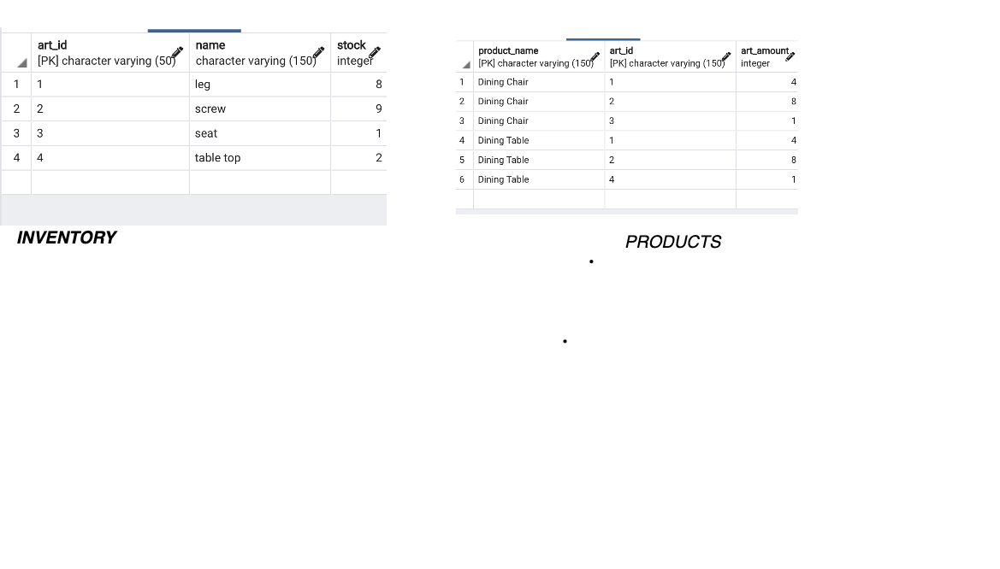

# inventory-assignment

This API has two functionalities 
* GET API : Get all products and available quantity of each Product.
```http
GET /products/getAll
```
## Responses

```javascript
[
    {
        "ProductName": string,
        "Quantity": 1
    }
]
```
* POST API : Sell a product and update the inventory accordingly.

```http
POST /products/sell

```
## Request Body

```javascript
    {
        "ProductName": string,
        "Quantity": 1
    }
```

## Responses

```javascript
{
    "ProductName": string,
    "RequestedQuantity": int,
    "AvailableQuantity": int,
    "StausMessage": string
}
```

## DataBase
Database is Postgres 

<br />
<a href="https://www.postgresql.org/about/">
  
</a>
<br />

Below are 2 belows




### SQL Statement to Create Tables:

```sql
CREATE TABLE INVENTORY (
    ART_ID varchar(50) PRIMARY KEY ,
    NAME varchar(150) NOT NULL,
    STOCK INT
);


CREATE TABLE PRODUCTS
(
    PRODUCT_NAME varchar(150) NOT NULL,
    ART_ID varchar(150) NOT NULL,
    ART_AMOUNT INT ,
    PRIMARY KEY (PRODUCT_NAME, ART_ID)
);

```

### Running the Application locally

Prerequisites:
 1. Start the postgres DB using a docker image : For local test not doing any volume mount. So if you restart the container the data will be lost

 ```docker 
  docker run --name some-postgres -p 5432:5432 -e POSTGRES_PASSWORD=mysecretpassword -d postgres
 
 ``` 

The default postgres user and postgres database are created


 2. To connect to the container, in order to do some work run the following

 ```docker
  docker exec -it some-postgres bash

  su postgres

  psql

  SELECT 1;

``` 

     OR

Via pgadmin tool. Details you can find https://www.pgadmin.org/


Set the enviroment variables:
 ```shell
export DB_USER=postgres
export DB_PASSWORD=mysecretpassword
export DB_HOST=127.0.0.1
export DB_PORT=5432
export DB_NAME=postgres
 ```

### Test Data

 ```sql
INSERT INTO INVENTORY
VALUES('1', 'leg', 13),
('2', 'screw', 17),
('3', 'seat', 2),
('4', 'table top', 1);

INSERT INTO PRODUCTS
VALUES ('Dining Chair', '1', 4),
('Dining Chair', '2', 8),
('Dining Chair', '3', 1),
('Dining Table', '1', 4),
('Dining Table', '2', 8),
('Dining Table', '4', 1);
 ```

 3. Need to have make installed in your system Otherwise you can run manually

 ```make
 make run
  ```

  ## Things to be done:
  1. CI/CD Deployment Pipeline 
  2. Security
  3. Write a logger library
  4. Need to add few more unit test cases
  5. Need to improve Error Handling if DB connection failed 
